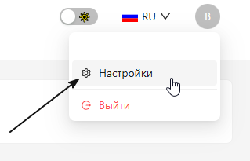
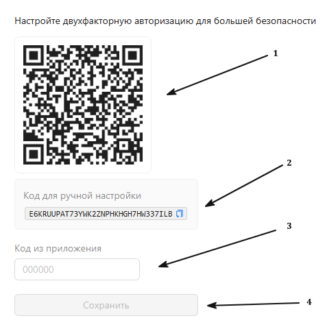

<h1 style="color: black; font-size: 2.2em; font-weight: bold; margin-bottom: 30px;">1. Personal Account Security Settings</h1>

  

    
The first thing we'll start learning is setting up the security of your personal account. The numbers on the screenshot show how to do it.

    <h3 style="color: black; font-size: 1.5em;">Step-by-Step Guide</h3>
    
<strong>1. Step:</strong> In the upper right corner, find your personal account icon, hover over it with the mouse — a menu opens with your login and settings. Click on "Settings".

  

  

    
    
Step 1: Go to Settings

  

  

    
<strong>2. Step:</strong> After you have gone to settings, open the "Security" section, click the "Configure" button and set up 2FA:

    

      <strong>①</strong> Scan the QR code, save it in the Google Authenticator app.
    

    

      <strong>②</strong> If you cannot scan the QR code, copy the code offered by your personal account, paste it into the Google Authenticator app, set a name, and save it.
    

    

      <strong>③</strong> Then enter the 6-digit code.
    

    

      <strong>④</strong> Click the "Save" button.
    

  

  

    
    
Step 2: 2FA Setup

  

  

    Congratulations! You have just made your personal account more secure. Great job!
  

  <a href="#/en/" style="padding: 10px 20px; background-color: #FFDAB9; border-radius: 6px; color: black; text-decoration: none; font-weight: bold;">← Back</a>
  <a href="#/en/shift" style="padding: 10px 20px; background-color: #FFDAB9; border-radius: 6px; color: black; text-decoration: none; font-weight: bold;">Next →</a>

